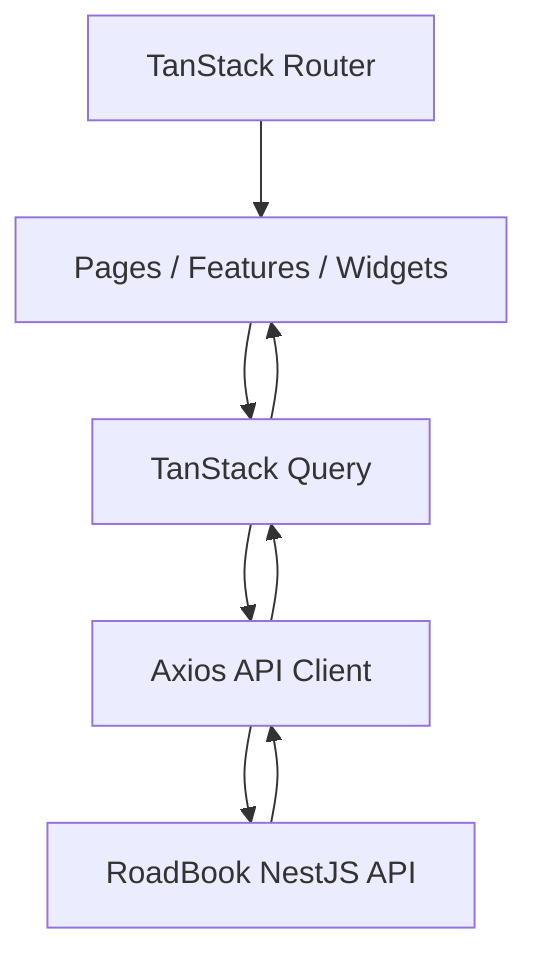

# RoadBook Frontend

Frontend application for **RoadBook**, a web application for planning, documenting, discovering, and sharing road trips.

The production frontend is deployed on **Vercel**.

🌐 **Live Demo:** https://roadbooktravel.com

The application provides a responsive interface for exploring community routes, creating and editing personal routes, managing stops and photos, viewing routes on a map, and interacting through comments, likes, and favorites.

## Features

- User registration and login
- Cookie-based authentication with automatic access-token refresh
- Guest and authenticated route protection
- User profile editing, avatar management, and public profiles
- Account deletion
- Explore page with search, filtering, sorting, and pagination
- Personal and favorite route lists
- Route creation and editing
- Route tags and ordered stops
- Drag-and-drop stop and photo reordering
- Place search and interactive route visualization
- Route covers and photo galleries with lightbox
- Comments, likes, and favorites
- English and Russian interface
- Responsive desktop and mobile layouts
- Custom 404 page

## Tech Stack

- **React 19**
- **TypeScript**
- **Vite**
- **TanStack Router**
- **TanStack Query**
- **Axios**
- **i18next / react-i18next**
- **Leaflet / React Leaflet**
- **dnd-kit**
- **yet-another-react-lightbox**
- **Lucide React**
- **CSS Modules**
- **Oxlint**

## Application Architecture

RoadBook uses a lightweight Feature-Sliced Design approach.

```text
src/
├── app/        # Application initialization, providers and routing
├── entities/   # Business entities, API calls, queries and reusable entity UI
├── features/   # User actions and feature-specific UI
├── pages/      # Route-level pages
├── shared/     # API client, i18n, utilities, assets and reusable UI
├── widgets/    # Larger layout components
└── main.tsx    # Application entry point
```

Main data flow:



The frontend keeps routing, server state, API communication, business entities, and UI concerns separated without introducing unnecessary architectural complexity.

## Project Structure

### `app`

Application-level configuration:

- providers
- TanStack Router setup
- file-based routes
- generated route tree
- global styles

### `entities`

Domain entities and related API/model logic:

- comments
- favorites
- places
- routes
- route stops
- tags
- users

### `features`

User-facing actions such as authentication, route management, stop/photo management, route maps, comments, likes, favorites, profile updates, avatar management, cover uploads, and account deletion.

### `pages`

Route-level screens include:

- Explore
- Login / Register
- Profile / Edit Profile / Public Profile
- My Routes / Favorites
- Create Route / Edit Route / Edit Route Stops
- Route Details
- Not Found

### `shared`

Reusable infrastructure and UI:

- Axios API client
- TanStack Query client
- i18n configuration
- formatting/parsing utilities
- debounce utility
- common assets
- modal
- pagination
- language switcher

### `widgets`

Application-level layout components:

- application layout
- guest layout
- header
- sidebar

## Routing

Routing is implemented with **TanStack Router**.

The Vite TanStack Router plugin generates the route tree from:

```text
src/app/routes
```

Generated routes are written to:

```text
src/app/routeTree.gen.ts
```

Automatic route code splitting is enabled.

Guest and authenticated routes are separated and protected with route guards.

The router receives the shared TanStack Query client through its context, allowing loaders and guards to work with cached server state.

> `routeTree.gen.ts` is generated automatically and should not be edited manually.

## Server State & API Client

Server state is managed with **TanStack Query**.

The shared `QueryClient` uses:

```text
retry: 1
refetchOnWindowFocus: false
```

Queries and mutations are grouped near their corresponding entities and features.

Typical server state includes:

- current user
- route lists and route details
- public profiles
- favorites
- comments
- tags
- place search

Mutations invalidate or update relevant cached data after server-side changes.

All backend requests use a shared Axios client.

The API base URL is configured with:

```text
VITE_API_URL
```

Credentials are enabled because authentication is cookie-based.

The client also sends the selected interface language in the `Accept-Language` header so localized backend errors match the frontend language.

## Authentication

RoadBook uses cookie-based JWT authentication provided by the backend.

The browser does not manage JWT values directly. Authentication cookies are sent using:

```text
withCredentials: true
```

When a request returns `401 Unauthorized`, the Axios response interceptor:

1. calls `/auth/refresh`
2. sends the authentication cookies
3. retries the original request once

A `_retry` flag prevents an infinite refresh loop.

Guest and authenticated routes are separated at the router level.

## Internationalization

The frontend supports:

- English (`en`)
- Russian (`ru`)

Internationalization is implemented with **i18next** and **react-i18next**.

Translation files are located in:

```text
src/shared/i18n/locales/
├── en.json
└── ru.json
```

The selected language is also sent to the backend through the `Accept-Language` header.

## Routes, Maps & Drag and Drop

Route-related functionality includes:

- route creation and editing
- tags
- place search
- ordered stops
- route building
- route distance and duration
- interactive route visualization
- route cover images
- photo galleries

Interactive maps are implemented with **Leaflet** and **React Leaflet**.

Routing and geocoding calculations are performed by the RoadBook backend.

**dnd-kit** is used for sortable interfaces, including:

- route stop reordering
- route photo reordering

The resulting order is persisted through backend API requests.

## Route Discovery & Details

The Explore page supports:

- text search
- filters
- sorting
- pagination
- route cards

Search input uses debouncing to avoid unnecessary API requests while typing.

The Route Details page presents:

- overview
- map
- photos
- comments
- likes
- favorites

Route photos can be viewed using a lightbox.

## Responsive Design

RoadBook is designed for desktop and mobile use.

Responsive layouts are implemented for navigation, Explore, authentication, profiles, route details, route creation/editing, route stop management, My Routes, Favorites, and Not Found.

Styling is implemented with CSS Modules and global application styles.

## Environment Setup

Create the environment file:

```
cp .env.example .env
```

Required variable:

```text
VITE_API_URL=
```

Example for local development:

```text
VITE_API_URL=http://localhost:3000/api
```

> Vite exposes `VITE_*` variables to browser code. They must never contain secrets.

## Local Development

### Requirements

- Node.js
- npm
- running RoadBook backend API

Install dependencies:

```
npm install
```

Start the development server:

```
npm run dev
```

Vite will print the local development URL in the terminal.

## Available Scripts

| Command | Description |
|---|---|
| `npm run dev` | Start the Vite development server |
| `npm run build` | Type-check and create a production build |
| `npm run lint` | Run Oxlint |
| `npm run preview` | Preview the production build locally |

## Production Build & Deployment

Create a production build:

```bash
npm run build
```

Generated static files are written to:

```text
dist/
```

Preview locally:

```bash
npm run preview
```

The planned production deployment is **Vercel**, with the RoadBook backend deployed separately.

Configure the production API URL:

```text
VITE_API_URL=https://<backend-host>/api
```

Because authentication uses cross-origin cookies, the production frontend URL and backend CORS/cookie configuration must be compatible.

No `vercel.json` is currently required. Deployment-specific configuration can be added if routing behavior requires it.

## Backend Integration

The frontend communicates with the separate RoadBook NestJS API.

The backend provides:

- authentication
- users and profiles
- routes and stops
- route search/filtering/sorting
- tags
- comments
- likes
- favorites
- file storage
- routing and geocoding

The backend also provides Swagger / OpenAPI documentation.

## Development Tools

TanStack Router and TanStack Query development tools are included for development.

They can be used to inspect route state, navigation, query cache, and loading/error states without affecting the production UI.

## Project Status

The main RoadBook frontend functionality is implemented.

Current phase: **production deployment and final validation**.

## Possible Future Improvements

- Password recovery interface
- Email verification flow
- Additional automated component and end-to-end tests
- CI/CD pipeline
- Further accessibility improvements
